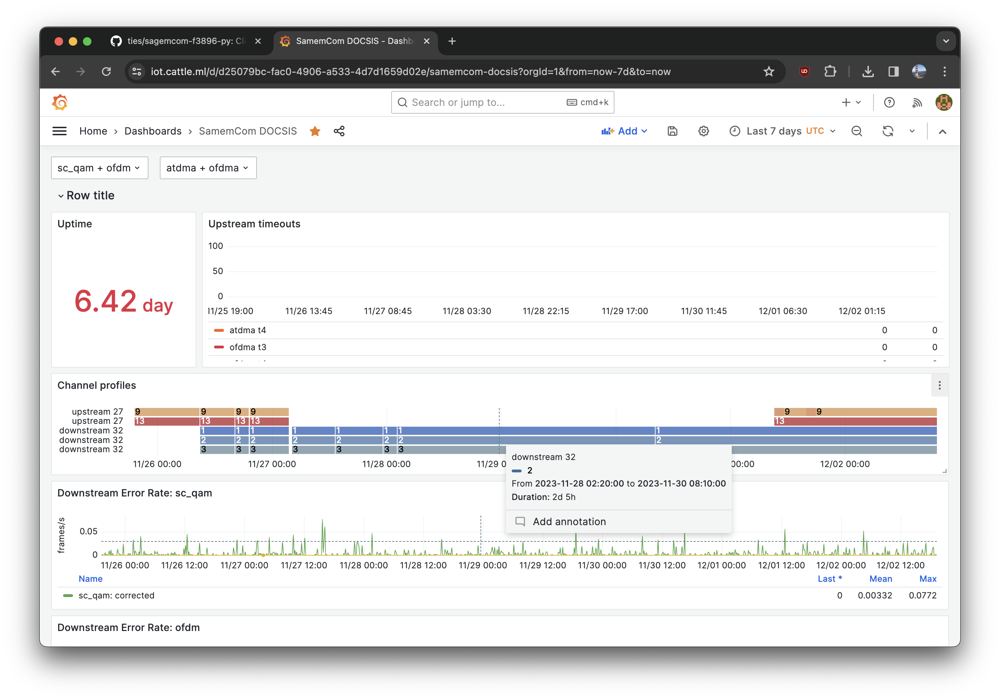

# Sagemcom F3896 client

A client for the Sagemcom F3896 modem.

Main goal of @ties is to have metrics from the modem, but the general structure should allow this libary to be used to add other features.

It contains a prometheus exporter with metrics from the modem. By default
this is at `127.0.0.1:8080/metrics`.

After this data is collected by prometheus it can be used to alert based on metrics, or to visualise it. For example using the pre-made dasboard [20072](https://grafana.com/grafana/dashboards/20072-samemcom-docsis/).



## Compatibility

| Router model | Provider(s) | Comments |
| -------------------------- | ---------- | --------------------------------- |
| Connectbox Giga (F3896-LG) | Ziggo (NL) | Primary development on this modem |

## Running

Using poetry
```
$ poetry run python3 -m sagemcom_f3896_client.cli --help
Usage: python -m sagemcom_f3896_client.cli [OPTIONS] COMMAND [ARGS]...

Options:
  -v, --verbose
  --help         Show this message and exit.

Commands:
  downstreams
  logs
  reboot
  status
  upstreams

$ poetry run python3 -m sagemcom_f3896_client.cli status
| ---------------- | ---------------------------- |
| Model            |                      F3896LG |
| MAC address      |            44:05:DE:AD:BE:EF |
| Serial number    |                 YBXS31100000 |
| Hardware version |                          1.2 |
| Software version |         LG-RDK_6.9.35-2456.1 |
| Uptime           |             15 days, 6:04:14 |
| Boot file        |     bac102000106440deadbeefa |
| DOCSIS version   |                          3.1 |
| Status           |                  operational |
| Max CPEs         |                            3 |
| Access allowed   |                            1 |
| ---------------- | ---------------------------- |
$ poetry run python3 -m sagemcom_f3896_client.exporter -v
INFO:__main__:Starting exporter on port 8080
DEBUG:sagemcom_f3896_client.client:logging in because 'rest/v1/system/info' requires authentication
DEBUG:sagemcom_f3896_client.client:GET http://192.168.100.1/rest/v1/cablemodem/eventlog 200 1.777 OK
INFO:__main__:Dropping profile message for no longer present downstream channel 27
INFO:__main__:Dropping profile message for no longer present downstream channel 32
DEBUG:sagemcom_f3896_client.client:POST http://192.168.100.1/rest/v1/user/login 201 3.023 Created
DEBUG:sagemcom_f3896_client.client:GET http://192.168.100.1/rest/v1/system/info 200 0.051 OK
DEBUG:sagemcom_f3896_client.client:Logging out session userId=3
...
```

Or, for example, run the prometheus exporter using docker compose:
```yaml
version: '3.7'

services:
  sagemcom_exporter:
    image: ghcr.io/ties/sagemcom-f3896-py:latest
    deploy:
      resources:
        limits:
          cpus: 0.1
          memory: 128M
    restart: always
    ports:
      - 8080:8080
    environment:
      MODEM_PASSWORD: PASSWORD123
```

## Changelog

  * 18-10-2023:
    * Keep the profile messages if they expire and channel is still present on
      modem.

## Endpoints

The client implements some endpoints. Others are:
```
GET /rest/v1/system/gateway/provisioning

{"provisioning":{"mode":"disable","macAddress":"44:05:3f:92:a2:4c","dsLite":{"enable":false}}}

GET /rest/v1/system/languages

GET /rest/v1/mta/lines
{"lines":[{"id":1,"line":{"enable":false,"operational":false}},{"id":2,"line":{"enable":false,"operational":false}}]}

GET /rest/v1/wifi/band2g/defaults
{"defaults":{"ssid":{"name":"Ziggo1234567","passphrase":"DEADBEEFjc8pdmko"}}}

GET /rest/v1/system/ui/defaults
{"defaults":{"password":"DEADBEEFpxeo"}}

POST /rest/v1/system/factoryreset
> {"factoryReset":{"enable":true}}
< {"accepted":true}

GET /rest/v1/cablemodem/registration

GET /rest/v1/echo
> {"echoStatus":"success"}
< 

GET /rest/v1/system/firstinstall
{"firstInstall":{"complete":false}}

GET /rest/v1/system/softwareupdate
{"softwareUpdate":{"status":"complete_from_provisioning"}}

POST /rest/v1/user/3/tokens
> {"password":"DEADBEEFxeo"}
< {"created":{"token":"18ae8b1525b76f2b3c151f3dd1c73499","userLevel":"regular"}}

PATCH /rest/v1/user/3/password


PUT /rest/v1/system/firstinstall
> {"password":{"password":"DEADBEEFpxeo","newPassword":"DEADBEEF123"}}
204 No Content

PUT /rest/v1/system/firstinstall
> {"firstInstall":{"complete":true}}
204 No Content
```
